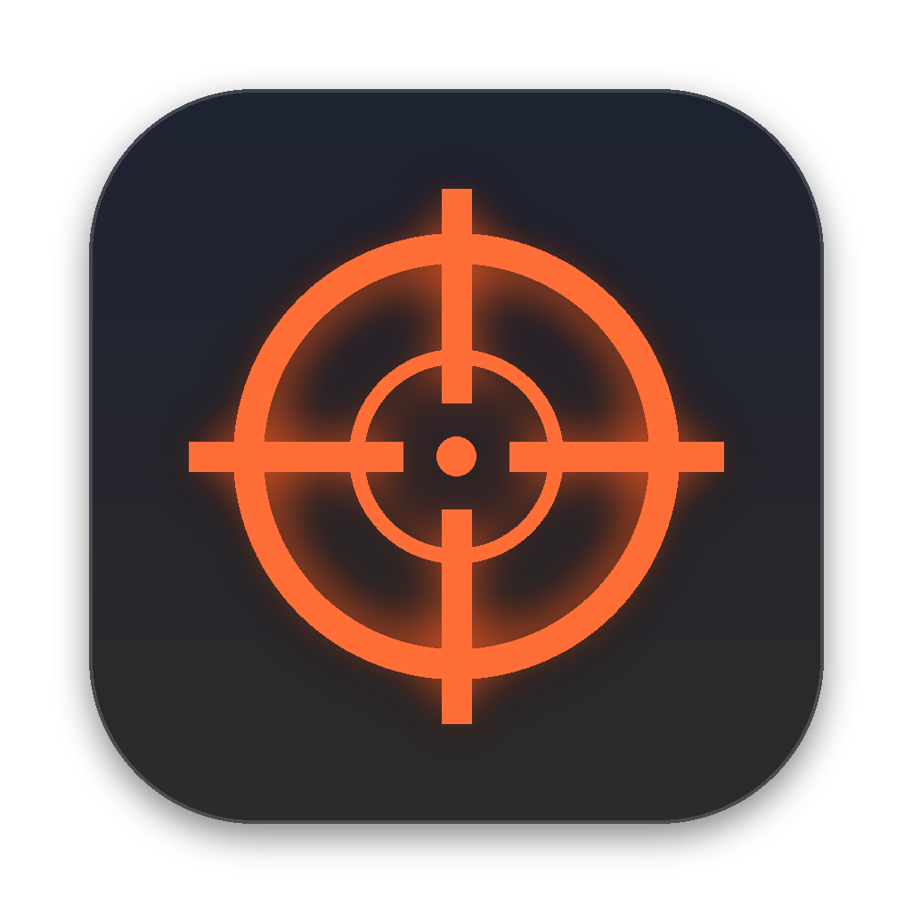

<p align="center"></p>

# SPARIAPS

> **Sparatutto arena in prima persona · Ondate · Zombie · Boss**
> Salta, spara, sopravvivi. Un FPS frenetico che gira direttamente nel browser, senza installare nulla.

|  |  |
|---|---|
| **Prezzo** | 🟢 **GRATIS** |
| **Genere** | Azione, Sparatutto, FPS, Arena, Sopravvivenza a ondate |
| **Sviluppatore** | Flavio Cecca |
| **Editore** | Flavio Cecca |
| **Piattaforma** | Windows · macOS · qualsiasi browser moderno |
| **Modalità** | Giocatore singolo |
| **Supporto controller** | ✅ Completo (Xbox e PlayStation) |
| **Lingua** | Italiano (interfaccia, testi) |

**Tag popolari:** `FPS` `Arena Shooter` `Zombie` `Ondate` `Boss` `Frenetico` `Movimento veloce` `Loot` `Gratis` `Supporto controller`

---

## INFORMAZIONI SUL GIOCO

**SPARIAPS** è uno sparatutto in prima persona veloce e senza pause, ispirato ai grandi arena shooter e alle modalità a ondate più amate. Scegli la tua classe, entra nell'arena e resisti a ondate di nemici sempre più numerosi e aggressivi. Ogni cinque ondate arriva un boss.

Usa la **cassa misteriosa** per ottenere armi leggendarie, raccogli **granate, fumogeni e coltelli da lancio**, sfrutta **trampolini e piattaforme sospese** per prendere quota e **sporgiti dagli angoli** come un vero operatore tattico.

Di giorno affronti **bot corazzati** su un'arena piena di luci al neon. Di notte l'arena è infestata da **orde di zombie**, e alcuni di loro sanno arrampicarsi.

---

## CARATTERISTICHE PRINCIPALI

- 🗺️ **Due mappe**, da scegliere prima di ogni partita
  - **Quartiere:** un incrocio di città con piazza e fontana, vicoli, parcheggio, officina e benzinaio. Auto, autobus e palazzi per ripararsi; nella Classica i trampolini portano sui tetti.
  - **Arena:** il campo di prova aperto e simmetrico, con muri bassi, casse e piattaforme sospese.
- 🎯 **Due modalità di gioco**
  - **Classica:** arena verticale con piattaforme sospese, trampolini e doppio salto, contro bot armati che ti cercano e rispondono al fuoco.
  - **Zombie:** notte, nebbia e orde corpo a corpo. Corridori, arrampicatori dagli occhi viola e abomini giganti.
- 💀 **Boss ogni 5 ondate, in tre fasi:** il **COLOSSO** nella Classica (razzi a ventaglio e bombardamento annunciato da cerchi rossi), l'**ABOMINIO** nella modalità Zombie (colpo a terra da schivare saltando, raffiche di acido). A ogni fase chiamano rinforzi.
- 👾 **Nemici speciali:** zombie **sputatori** che colpiscono da lontano, **esplosivi** che scoppiano addosso e **corazzati** resistenti ai proiettili; nella Classica i **cecchini**, che ti puntano con un laser prima di sparare.
- 🔧 **Banco armi:** spendi i crediti per potenziare danno, caricatore e ricarica delle armi che porti con te.
- 🥤 **Distributore di perk:** tra un'ondata e l'altra compri abilità permanenti come Pelle dura, Mani svelte o Doppio colpo.
- ❤️ **Seconda vita:** una vita di scorta a partita, e altre da guadagnare battendo i boss.
- 🎁 **Cassa misteriosa:** spendi i crediti guadagnati con le uccisioni e tenta la sorte, dall'arma comune alla **leggendaria**. Poi la cassa sparisce e ricompare altrove.
- 🔫 **13 armi**, ognuna con modello, suono e sistema di mira dedicati: tacche metalliche, red dot, olografici e ottiche.
- 🧍 **5 classi**, ognuna con arma principale e bonus unici. Puoi cambiarla a partita in corso, per un massimo di 2 volte.
- 💣 **Equipaggiamento da lancio:** granate a frammentazione, stordenti, fumogeni che bloccano la visuale dei nemici e coltelli da lancio.
- 🪖 **Sporgersi alla Rainbow Six Siege:** mentre miri, sbuca di lato dalle coperture senza esporti.
- ⚡ **5 bonus a tempo:** Super salto, Velocità, Munizioni infinite, Danno x3, Invulnerabile.
- 💥 **Esplosioni spettacolari:** palla di fuoco a strati, onda d'urto, detriti che rimbalzano, colonne di fumo e bruciature sul terreno.
- 🎮 **Supporto controller completo:** rilevamento automatico, vibrazione, aiuto alla mira, simboli Xbox o PlayStation e menu navigabili col pad.
- 🎵 **Colonna sonora originale** con brani dedicati a ogni modalità e loop senza interruzioni durante la partita.
- 🗺️ **Minimappa, danni a schermo, killfeed e 5 livelli di difficoltà**, dalla Facile alla Progressiva.

---

## MODALITÀ DI GIOCO

### ⚔️ CLASSICA
> *Arena: ondate di bot armati, piattaforme sospese, trampolini e doppio salto. Muoviti veloce, prendi quota e non restare mai fermo.*

### 🧟 ZOMBIE
> *È calata la notte e l'arena è infestata. Le orde crescono a ogni ondata, e gli arrampicatori dagli occhi viola scalano casse e muri: nessun posto è davvero sicuro.*

**Difficoltà:** Facile · Normale · Difficile · Incubo · **Progressiva** (parte facile e diventa più dura a ogni ondata)

---

## CLASSI

| Classe | Arma principale | Bonus |
|---|---|---|
| **ASSALTATORE** | Fucile d'assalto | Equilibrato in tutto |
| **INCURSORE** | Fucile a pompa | +25 scudo iniziale |
| **CECCHINO** | Fucile di precisione | Mirino ottico ad alto ingrandimento |
| **MITRAGLIERE** | Mitragliatrice leggera | +50 scudo iniziale |
| **ESPLORATORE** | Mitraglietta | Movimento +12% |

*Pistola e coltello sono sempre con te.*

---

## ARSENALE

| Arma | Tipo |
|---|---|
| Fucile | Automatica, versatile |
| Pistola | Semiautomatica, sempre nello zaino |
| Fucile a pompa | 8 pallini, devastante a corto raggio |
| Fucile di precisione | Ottica, one-shot alla testa |
| Mitragliatrice leggera | Caricatore da 80 colpi |
| Mitraglietta | Cadenza altissima |
| Revolver Magnum | Colpi pesanti |
| Micro SMG | La più rapida di tutte |
| Fucile a raffica | Raffiche da 3 colpi |
| Fucile tattico | Semiautomatico con ottica |
| Minigun | 200 colpi, canne rotanti |
| Lanciarazzi | Danno ad area |
| Pistola a raggi | Plasma esplosivo *(solo dalla cassa)* |

---

## COMANDI

### Tastiera e mouse

| Azione | Tasto |
|---|---|
| Muoviti | `W` `A` `S` `D` |
| Spara / Mira | `Click SX` / `Click DX` |
| Corri / Salta (doppio in arena) | `Shift` / `Spazio` |
| Accucciati | `C` |
| Sporgiti (mentre miri) | `Q` / `E` |
| Cambia arma | `1` `2` `Rotella` `Q` |
| Coltellata | `V` / `F` |
| Ricarica | `R` |
| Usa cassa / raccogli arma | `E` |
| Getta arma | `B` |
| Granata · Stordente · Fumogeno · Coltello | `G` · `Z` · `X` · `T` |
| Avvia subito l'ondata | `Invio` |
| Pausa · Audio | `P` / `Esc` · `M` |

### Controller

| Azione | Xbox | PlayStation |
|---|---|---|
| Muoviti / Guarda | Stick sinistro / destro | Stick sinistro / destro |
| Spara / Mira | `RT` / `LT` | `R2` / `L2` |
| Salta | `A` | `✕` |
| Accucciati | `B` | `○` |
| Ricarica / Interagisci | `X` | `□` |
| Cambia arma | `Y` | `△` |
| Corri / Sporgiti a sinistra (mentre miri) | `L3` | `L3` |
| Coltellata / Sporgiti a destra (mentre miri) | `R3` | `R3` |
| Granata / Coltellata | `LB` / `RB` | `L1` / `R1` |
| Stordente · Fumogeno · Coltello · Getta arma | Croce direzionale | Croce direzionale |
| Avvia ondata · Pausa | `View` · `Menu` | `Create` · `Options` |

> Collega un controller e il gioco passa da solo alla modalità controller.

---

## REQUISITI DI SISTEMA

| | **Minimi** | **Consigliati** |
|---|---|---|
| **Sistema operativo** | macOS, Windows o Linux con browser moderno | Windows 10/11 o macOS con Google Chrome |
| **Browser** | Chrome, Edge, Safari o Firefox recenti con WebGL 2 | Google Chrome (ultima versione) |
| **Processore** | Dual core | Quad core o Apple Silicon |
| **Scheda video** | Grafica integrata con WebGL 2 | GPU dedicata o Apple Silicon |
| **Memoria** | 4 GB di RAM | 8 GB di RAM |
| **Spazio su disco** | ~50 MB | ~50 MB |
| **Rete** | Connessione al primo avvio, per caricare il motore grafico | Idem |
| **Note** | Qualità grafica **Bassa** consigliata | Qualità grafica **Alta** |

---

## COME GIOCARE

1. Avvia il gioco con un doppio clic. Parte in una finestra dedicata, con la musica già attiva:
   - **Windows:** apri **`Spariaps.bat`**. Usa Google Chrome oppure Microsoft Edge, già presente in Windows 10/11.
   - **macOS:** apri **`Spariaps.app`**. Usa Google Chrome.
2. In alternativa apri **`index.html`** con un browser moderno. In questo caso la musica parte dopo il primo clic.

> **Windows · collegamento con l'icona:** tasto destro su `Spariaps.bat` → *Mostra altre opzioni* → *Crea collegamento*. Poi apri le *Proprietà* del collegamento → *Cambia icona…* e scegli **`Spariaps.ico`**.
3. Scegli **modalità** e **difficoltà**, premi **GIOCA**, seleziona la **mappa** e la **classe** e buona fortuna.

Dalle **Impostazioni** puoi regolare:
- luci, luminosità e qualità grafica (3 livelli);
- sensibilità di mouse e controller;
- mira tenendo premuto o con un clic;
- mira semplificata e aiuto alla mira;
- volume separato per musica, armi, nemici, effetti e interfaccia;
- schermo intero.

---

## CONTENUTO DELLA CARTELLA

```
Spariaps/
├── Spariaps.bat      → avvio con un doppio clic (Windows)
├── Spariaps.ico      → icona per il collegamento su Windows
├── Spariaps.app      → avvio con un doppio clic (macOS)
├── Spariaps-icona.png → logo del gioco
├── index.html        → il gioco completo
└── Music/            → colonna sonora (brani del menu e loop di gioco)
```

---

<p align="center"><b>SPARIAPS</b> · Nessun posto è davvero sicuro.</p>
